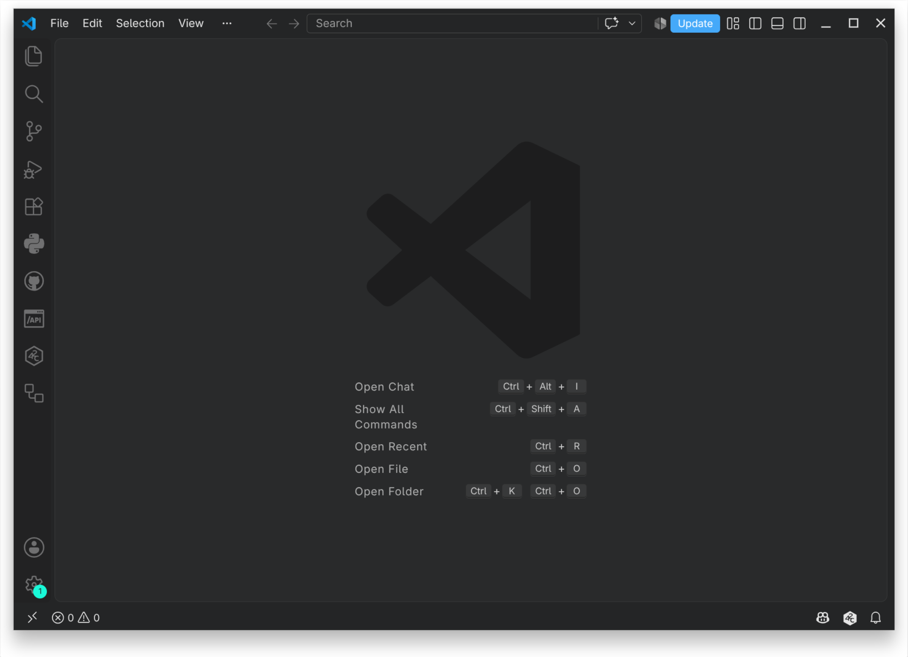
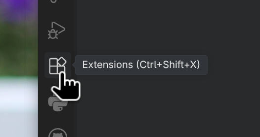
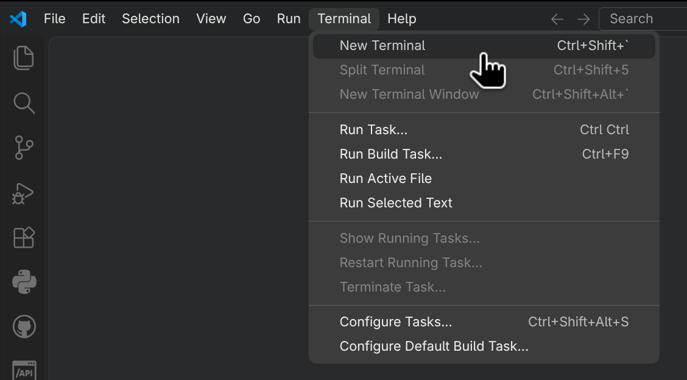
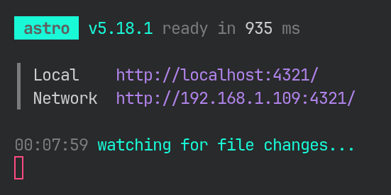
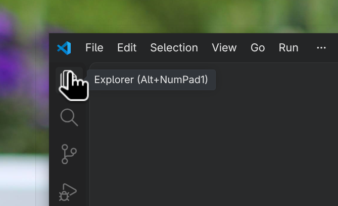
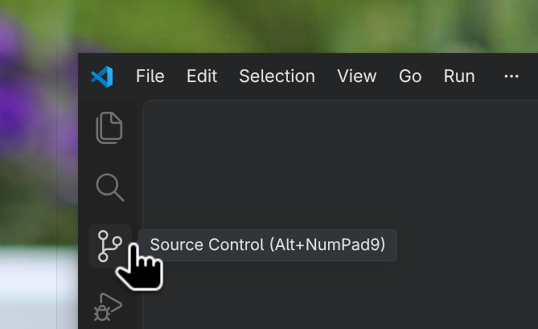
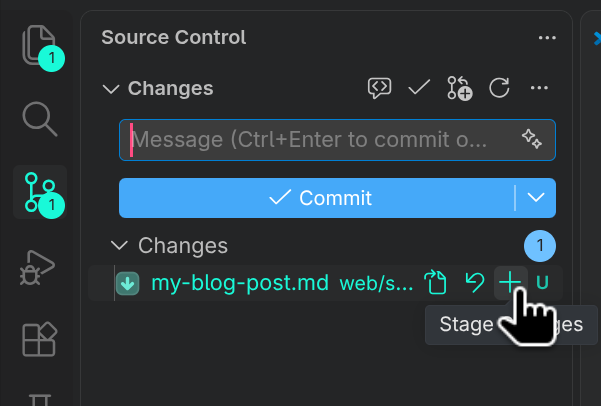
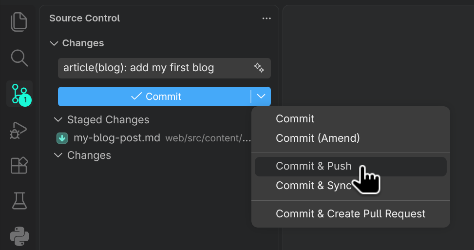

# Writing blogs for Periodt

This is your one stop whistle stop tour of everything you need to write your first (or second, hopefully even third) blog for Periodt!

## How is Periodt's blog made?

This part is mostly for background in case either you want to modify the site itself or just need to google some strange problem that coems up

The blog is hosted statically with Astro as a framework without any UI framework on top. Styling is done with tailwind css for convenience. The site is served on cloudflare paages and is automatically rebuilt on a commit to the `main` branch that modifies the `web/` directory.

If that last bit sounded like a bunch of waffly jargon don't worry it'll be explained later.

## What do I need to install? (and how?)


### 1. git

Git is a "version management" tool, if you aren't familiar think about it like google drive but for code. Essentially a way for a group of people to work together on one piece of code.

The big difference from google drive is that the changes you make arent sent to everyone instantly instead you group them into "commits". We'll go into more detail on how this works later.

You can install git [here](https://git-scm.com/install/).
  
### 2. pnpm

Pnpm is our "package manager" essentially its a tool for managing other tools to help build websites. Later on you'll need it to run your own local version of the blog so you can see the changes as you make them.

You can install pnpm [here](https://pnpm.io/installation). Although be warned it's pretty jargon-ey. In short to install it:

- #### On Windows

    Open the Powershell (Windows 10) or Terminal (Windows 11) and paste in the following command and press enter 

    ```powershell
    Invoke-WebRequest https://get.pnpm.io/install.ps1 -UseBasicParsing | Invoke-Expression
    ```

- #### On MacOS

    Open the Terminal app and paste the follwing:

    ```bash
    curl -fsSL https://get.pnpm.io/install.sh | sh -
    ```

- #### On Linux

    Open your Terminal emulator of choice and paste the follwoing

    ```bash
    curl -fsSL https://get.pnpm.io/install.sh | sh -
    ```

### 3. Something to edit blogs in

You can use pretty much any text editor here but we'll use vscode here for a few reasons:

- It's the most widely used
- It's more visual than most other options
- It has inbuilt git (and github) integration

You can install it [here](https://code.visualstudio.com/).

Once it's installed and you open the app you should see something a little like this. (Some buttons may look slightly different or be in slightly different places depending on your setup)



Next up we're going to want to add some extra things to help you write blogs, if you open the extensions tab by pressing the button shown here:



Now search for and install

- [Astro](https://marketplace.visualstudio.com/items?itemName=astro-build.astro-vscode) - This gives better support if you need to modify the actual website code
- [Code Spell Checker](https://marketplace.visualstudio.com/items?itemName=streetsidesoftware.code-spell-checker) - Pretty much what it says on the tin

You may also want to try out some different "themes" for the editor to feel a little more at home

#### Some alternatives:

Personally my favourite is neovim although its a lot less "batteries included" so you'll likely find vscode the simplest to get started with.

Some more options are:

- [Zed](https://zed.dev/)
- [VsCodium](https://vscodium.com/)
- [Sublime Text](https://www.sublimetext.com/)

## One last thing to set up

Periodt's source code (both for the app and blog) are hosted on [GitHub](https://github.com/) and you need an account to be able to make your own changes to periodt's code.

You can sign up [here](https://github.com/signup?source=form-home-signup&user_email=) and can find periodt's code [here](https://github.com/periodt-tracker/periodt).


## Markdown - what is it?

All of periodt's blog posts are written in a plaintext format called markdown. It may sound big and scary but don't worry the whole idea is it stays out of your way. (This document is written in it actually)

Most of the time you can litterally just write normally except for when you need special formatting say **bold** text or *italics* or even perhaps

# A Title

## Or perhaps a subtitle

Here's short guide on pretty much everything you need:

- Title's are written starting with a hashtag `#`

    ```md
    # This is my title
    ```

  For each sub-level level of title simply include another hashtag

    ```md
    ## A subtitle

    ### An even smaller title

    #### Smaller Again

    ##### And again!
    ```

- *Italic* text should be surrounded by a single asterisk on each side of what you want to make italic.

    ```md
    *this text is italic* everything after the asterisk is not
    ```

- **Bold** text is similar just use two asterisks instead

    ```md
    **this text is bold** and this text is not
    ```
- ~~Strike through's~~ can be made by surrounding text with two tidle's
    ```md
    ~~This text is crossed out!~~
    ```
- You can make lists (like this one) like so:

    ```md
    - My first bullet point
    - My second one!
    - My third
    ```

  or for a numbered list

  ```md
  1. Something
  2. Something else
  3. Another thing
  ```

  You can also have multiple layers of lists and mix and match

  ```md
  1. My numbered list
     - Some subpoint
     - Another one
  3. Another point!
     a. A lettered list this time!
     b. I ran out of things to say
  ```

- You can also have tables like so

    | Animal      | Population |
    | ----------- | ---------- |
    | Dog         | 191        |
    | Cat         | 234        |


    You can add as many columns as you like

    ```md
    | Animal      | Population |
    | ----------- | ---------- |
    | Dog         | 191        |
    | Cat         | 234        |
    ```

- You can add quotes like so:

    > This is a fancy quote!

    ```md
    > This is a fancy quote!

    > And a
    > multi line
    > one!
    ```

- Finally you can add images like so

  ```
  
  ```

- And links like so

  ```
  [some text to show instead of the link](https://example.com)
  ```

You can find a better and more complete guide [here](https://www.kdnuggets.com/publications/sheets/Markdown_Cheatsheet_KDnuggets.pdf).

As an aside for some slightly more advanced features periodt's blog supports latex as well as callouts.

## Getting periodt's code

Now we're ready to actually write a blog post (sorry about all the waffle) we first need to download all of periodt's code

In vscode press `Ctrl+Shift+p` (or `Command+Shift+p` on MacOS) and type `Git: Clone` and press `Enter`

Then paste in the following url and press enter again:

```
https://periodt-tracker.com/
```

You may have to log into GitHub here, follow through any popups that show up to log in with your browser.

You now have your own local copy of Periodt!

## Starting your own test website

First we need to open a terminal like so:



And in the pane that opens type the following: (after each line press enter)

```bash
cd web
```

This changes your "current working directory" essentially just the folder you are in to the website folder.

```bash
pnpm install
```

This installs everything you need to run the website locally on your computer

```bash
pnpm run dev --host
```

And finally this starts the website. From now on you can run this command whenever you are writing a blog post to get a live preview of what your post will look like on the site.

You should see something like this in your terminal:



The most important part here is the two links you can see. If you click on either or type them into the url bar in your browser you should see a copy of periodt's website pop up.

Notably:

- The local one http://localhost:4321/ will only work on the exact device you are working on.
- The network one http://[your-ip]:4321/ will work for any device connected to the same network as you (this may depend on fireworks or other restrictions on the network you are using)

## Writing a post (...finally)

Now we truly have everything set up we can actually get to writing a post! (woooo)

In VScode on the left hand side you should hopefully see a file tree showing all of periodt's files. If not click the explorer icon here:



If you open the `website/` folder you should see a lot more files. This may look like a lot at first but here's a little map of sorts to help you find your way:

```
web/
├── public/
│   ├── fonts/
│   └── icons/
└── src/
    ├── assets/ (Where images go!)
    ├── content/
    │   └── blog/ (The important one! where the blogs go!)
    └── pages/ (Other pages around the webiste, like the home page, about, etc)
```

Note this skips out quite a few other folders that aren't really relevant unless you're modifying the website itself. 

So lets add a new blog post!

Open the `web/` folder then the `src/` folder within it, then `content/` and `blog/`. Finally right click that `blog/` folder and press new file.

Call it something like `my-blog-post.md`. This can be called anything as long as it ends in `.md` (for markdown). Just keep in mind that when you publish it the name of the file will be used in the url of the post.

For example `understanding-your-period.md` becomes https://periodt-tracker.com/blog/understanding-your-period/

Open that file and copy in the following: 

```
---
title: 'My first blog post!'
description: 'My description'
date: '2026-05-15'
image: '../../assets/blog/intro/intro_banner.png'
category: 'Announcement'
---
```

This is called the "preamble" essentially it just contains some meta information about the post like it's title description, when it was released etc. Have a play around with these.

Save the file (you can do this by pressing `Ctrl + S` or `Command + S` on MacOS) and now go back to your local website copy in your browser. You should now see your new post there.

Underneath this pre-amble you can just write markdown like we spoke about earlier.

And that's it! Go ahead write your post!

## Publishing

Now the big scary (or exciting?) part sharing it with the world. Open the source control tab from the buttons on the left. 



Once it's open you should see a list of the files you've changed, simply press the plus on each of them to "stage" them. This essentially means you are ready to save it and share it with everyone



Now you can write a message describing the changes you are making. These are useful for other people to see what changes have actually been made to the code whe looking through logs.

Periodt uses something called conventional commits, you don't need to care about most of what that means but always start a commit message adding a new blog post with `article(blog):`.

As an aside this is used to help filter commits by what they're for. Say when a bug fix is made to the mobile app it would be:

`fix(app): fix bug where x happens when y`

or adding a feature:

`feat(app): add new IUD contraception method`



Finally press commit & push. This will save your changes remotely and update the website (pretty please dont do this before anything is finished)