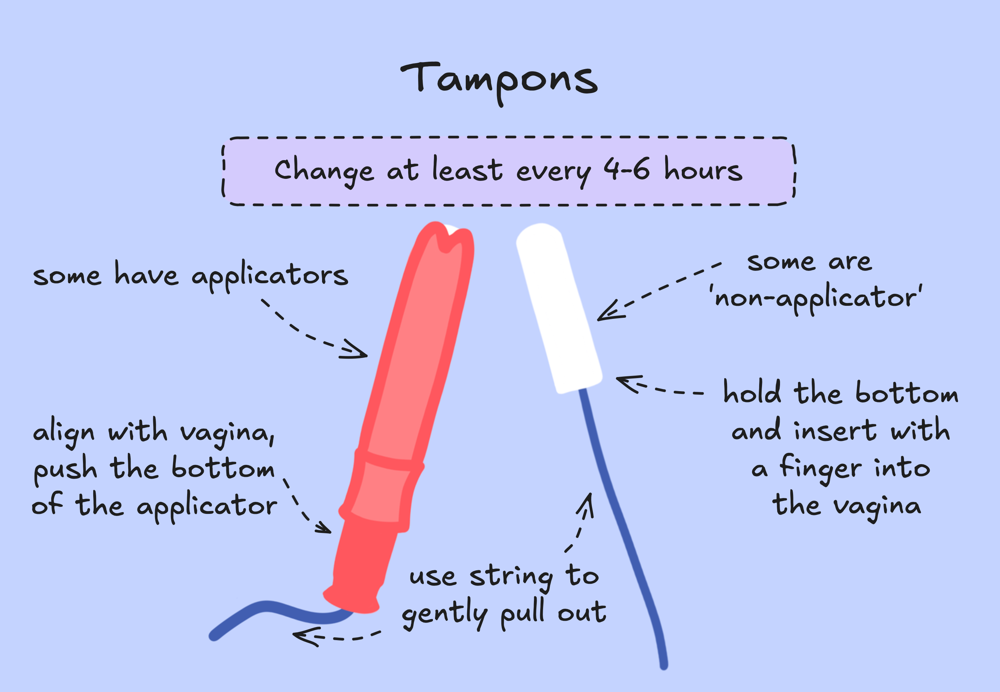
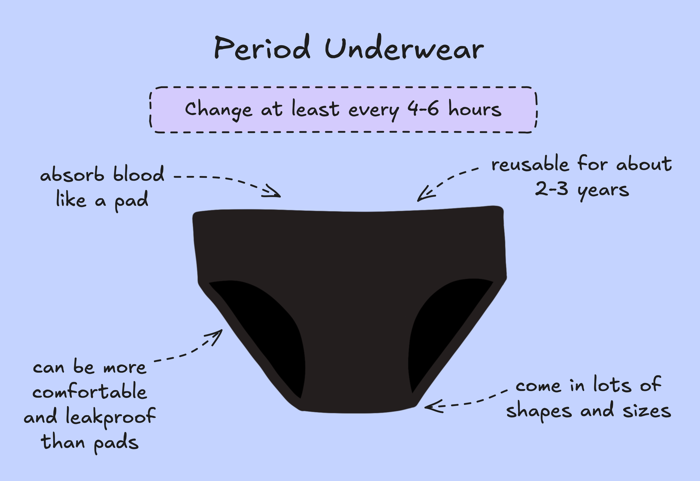

Choosing the right period product for you is difficult, especially if you aren’t aware of all of your options.

When trying to take into account affordability, comfort and cleaning methods for reusable methods, it’s important that the period product works best for you and your lifestyle. So, we’ll be going through some of the most common options to help you narrow it down!

## Pads

Pads are often regarded as the perfect beginners period product. Both disposable and reusable pads are made of absorbant materials that soak up your blood. 

To use a pad, you attach it to your underwear (either by the sticky backing with disposable pads, or with plastic snaps with reusable pads). 

You must change your pad at least every **4 to 6 hours**.

To clean reusable pads, immediately rinse them in cold water when you change them. Then, you can wash them in a washing machine, observing the instructions given with your specific pad. 

>[!positives] Positives
> - Pads can be easily found in most shops
>
> - They can be relatively cheap (especially non-branded options!)
>
> - They can be a more comfortable and accessible option compared to intrusive options like tampons, menstrual discs and menstrual cups
> Reusable pads are more environmentally friendly than disposable options

>[!negatives] Negatives
> - Some people feel uncomfortable in pads, as they feel like they are wearing a nappy, or that they are sitting in their own blood
> - It is quite easy to leak through the pad onto your clothes, especially if you:
>    - Have a heavy flow
>    - Are quite active 
>    - Toss and turn a lot in your sleep 
> - Reusable pads can be quite expensive compared to disposable options

## Tampons

Tampons are also made of absorbant materials that soak up your blood but, unlike pads, need to be inserted into the vagina to work. 

To insert a tampon, check the instructions inside (or on) the packaging.

> We will have blogs dedicated to learning to insert products like tampons, menstrual cups and menstrual discs coming soon!

It is recommended to change your tampon at least every 4 to 6 hours, but some tampons can be left in for 8 hours at an absolute maximum. Because of the risks of infections and conditions like Toxic Shock Syndrome, which we will touch upon later, it is better to change internal period products more often, and not wait until the maximum change time. 

>[!positives] Positives
>- When inserted properly, you cannot feel a tampon at all
>    - This removes some of the unpleasant sensations some feel with pads and other products
>- Generally leakproof unless your flow is heavy enough to bleed through the tampon in less time than the recommended wear time
>    - Can be a very good option for people with very active lifestyles

>[!negatives] Negatives
>- There is a bit of a learning curve when learning how to insert a tampon
>- It can be uncomfortable to insert a tampon for some people
>- As you can’t feel the tampon inside of you, it is easy to forget about it - stay on top of the time!
>    - I’d always recommend having a stopwatch or timer to ensure you don’t miss a change
>- You have to wake up to change it in the night, as you absolutely should not wear it for more than 8 hours
>- There is risk of infections or conditions like Toxic Shock Syndrome

## Menstrual Cups and Discs

While they may be quite an investment at first, menstrual cups and discs are more environmentally friendly than disposable period products. Like tampons, they have to be inserted into the vagina, but the insertion methods differ. Instead of absorbing blood like pads, tampons and period underwear, blood is collected by the menstrual cups and discs, that then has to be emptied out when they are removed. 

If you have an Intrauterine Device (IUD), it is recommended to use a menstrual disc instead of a menstrual cup, to avoid the suction seal. 

In between changes, menstrual cups and discs should be washed and cleansed with water and a mild soap or specialised cleanser. 

To properly clean menstrual discs and cups, you have to boil them to sterilise them between your cycles. This means that once your period has ended, you have to put the product into boiling water for around 5 minutes (this may differ on the brand and the materials they have used). After this, they must be fully dry before storing it again until your next cycle starts. 

>[!positives] Positives
>- Menstrual cups and discs are more environmentally friendly option than disposable period products
>- They have a longer wear time than pads and tampons, so can be better if you require less frequent changes

>[!negatives] Negatives
>- There is a large learning curve with learning how to insert a menstrual cup or disc
>- It can be very painful to insert at first, especially if you have not experienced any form of vaginal penetration before
>- They can be messy to remove
>- Properly cleaning them in shared dorms/kitchens may be outside of your comfort zone
>- There is an increased risk of infections and conditions like Toxic Shock Syndrome

## Period Underwear

Period underwear act similarly to reusable pads, in that they absorb blood. 

Like pads, they have to be replaced every 4-6 hours. 

To clean period underwear, they need to immediately be rinsed in cold water after they have been changed, then can be washed in a washing machine as per the instructions on your period underwear. 

>[!positives] Positives
> - They can be more comfortable than pads, and remove the bulky sensation

>[!negatives] Negatives
> - They can initially be expensive, however they could save money long term

## Toxic Shock Syndrome

When assessing different period products, it is essential to address Toxic Shock Syndrome (or TSS).

TSS is a condition resulting from the toxins released by certain bacteria. 

> Some examples of these bacteria include *Staphylococcus aureus* (staph) and *Streptococcus pyogenes* (group A strep).
>
> Future blogs will go into further depth on TSS.

TSS is most commonly associated with the use of internal period products, like tampons, menstrual cups and menstrual discs. Therefore, it is incredibly important to keep to the change times,and exercise caution when using these period products.

As long as you are following the instructions provided with your period products, everything should be okay! 

## So, how do I choose?

If you still are unsure about which period products to try, it can be useful to try a range out. You may end up feeling more comfortable in period products that you may not have initially tried!

I hope this guide has been useful in introducing the basics of some common period products.

Lots of Periodt love,

Julia :)