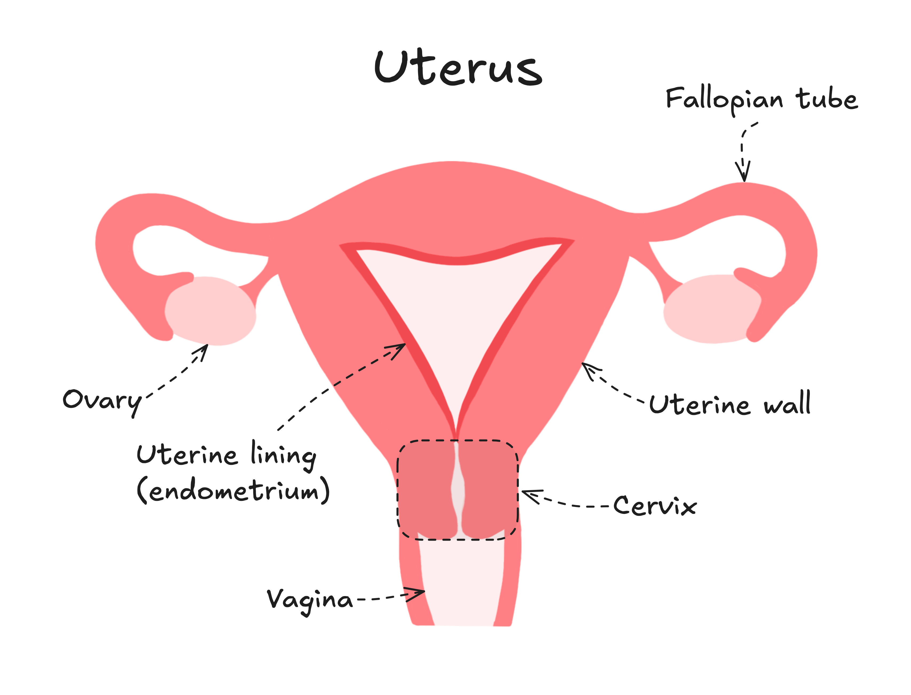
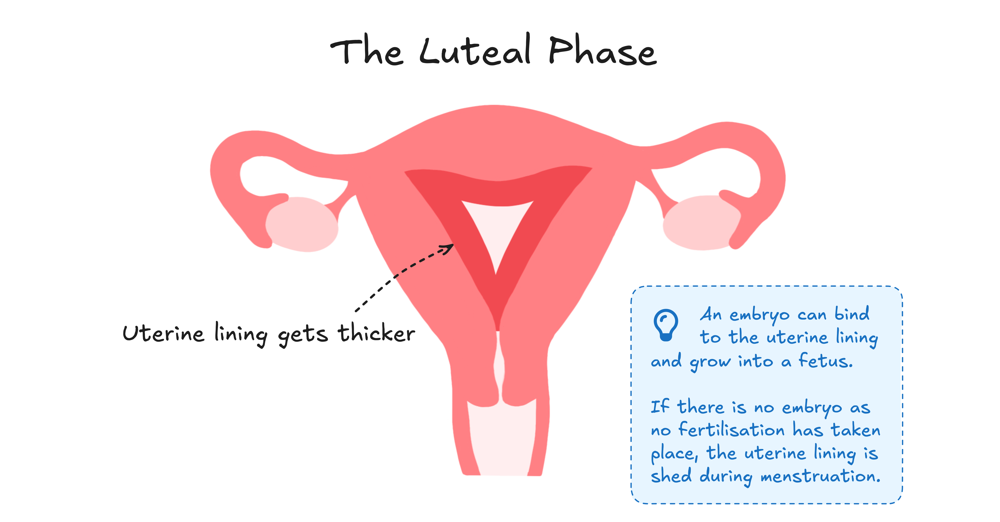

The menstrual cycle is a weird and wonderful process that affects your body in more ways than you can imagine. If you've ever wondered about what's going on, here's a guide to understanding your cycle!

> Throughout this blog, there will be these little boxes with more in-depth information. In the future, our blogs will go into more information on some of these topics!

## What is the menstrual cycle?

The menstrual cycle occurring on average every 28 days, preparing your body for a potential pregnancy. It is controlled by chemical messengers called **hormones** in your body. Most people have regular menstrual cycles can span from 21 to 35 days. 

Most people start their period around the age of 12, but many start earlier or later too. It all depends on what age you reach puberty at!

The menstrual cycle continues until you reach menopause, which happens when you are about 40-50 years old. During menopause, your periods become less frequent, before gradually coming to an end. 

## Breaking the menstrual cycle down

There are two key time periods during the menstrual cycle - the follicular and luteal period. There are also two 'main events' that happen during the menstrual cycle - menstruation and ovulation.

In Periodt, we break the menstrual cycle down into four subsections (menstruation, the follicular stage, ovulation and the luteal stage). We do this as this is a common way of dividing the menstrual cycle, and makes it a bit easier to understand how different levels of hormones change at different time periods.

But before we do this, we must take some time to understand the uterus, the star of the show.

## Understanding the Uterus 

Understanding your period becomes a bit easier when you understand what is happening inside of your body. 

The menstrual cycle exists to prepare your body for a potential pregnancy. To become pregnant, an egg cell released at ovulation must be fertilised by a sperm cell, creating an embryo. 

If the egg cell released at ovulation is not fertilised, the uterine lining is shed during menstruation (your period), and the cycle begins again!

### Menstruation

<h4>What is your period?</h4>

Menstruation is the main event associated with the menstrual cycle - your period. During your period, the blood coming out of your vagina is a mixture of blood and tissue from your uterine lining. 

Your blood flow is usually heaviest for the first 3-4 days of your period, after which it becomes lighter and lighter. 

During the very beginning of your period, the blood may appear dark brown. Around the middle of your period, the blood usually appears bright red, and by the end the blood gets darker and darker brown again. This is natural and nothing to worry about! Your period blood changes colours as it is older blood, or coming out more slowly, and has reacted with oxygen. 

<h4>Period Products</h4>

You can use a variety of different period products during your period. The main types of period products available include pads, tampons and menstrual cups, but other alternatives exist. These include:

- Period underwear
- Menstrual discs
- Reusable cloth pads
- Sea sponge tampons
- And many more!!

> We will cover how to choose the perfect period product for you in an upcoming blog!

<h4>Period Pain</h4>

During your period, you may experience pain in your lower abdomen. This can be period pain that is not linked to an underlying medical condition, or pain caused by underlying medical conditions.

The medical terms for these are **primary dysmenorrhea** and **secondary dysmenorrhea** respectively. 

> Some conditions that may contribute to period pain include endometriosis, adenomyosis, fibroids, pelvic inflammatory disease and more. 

Many people experience **Pre-Menstrual Syndrome (PMS)**. Many people experience physical symptoms like fatigue, bloating and changes in appetite, alongside psychological symptoms like mood swings, increased irritability and anxiousness. Symptoms typically starts a couple of days before you start your period, and continue through your period, gradually improving until the end of your period. 

> Some people experience a more severe form of PMS called **Pre-Menstrual Dysphoric Disorder (PMDD)**. If you are concerned about your PMS symptoms impacting your daily function, please seek help from a healthcare provider.
>
> You can find information published by the NHS about [PMS here](https://www.nhs.uk/conditions/pre-menstrual-syndrome/), and about [PMDD here!](https://www.nhs.uk/conditions/pmdd-premenstrual-dysphoric-disorder/)

Future blogs will examine PMS and PMDD in more depth.

## Follicular Stage

Many refer to their follicular stage as an ‘inner spring’. The follicular stage is the time between your period and ovulation. 

In your ovaries, there are little follicles which can mature into eggs when cued to do so by a hormone aptly named ‘Follicle Stimulating Hormone’ (FSH). 

Usually only one follicle matures into an egg per menstrual cycle, but sometimes two will mature. If you are undergoing fertility treatment, more will mature in a singular cycle!

During your follicular stage, your uterine lining is rebuilt after it was shed during your period. If you are trying to conceive, this lining is important as it creates a nutrient rich space for a fertilised egg to implant.

## Ovulation

Ovulation occurs when an egg is released from one of your ovaries. This egg travels down your fallopian tube into your uterus. If this egg becomes fertilised by sperm, it creates an embryo. This embryo then grows into a fetus with the right nutrition from the uterine lining.

## Luteal 

The luteal phase is often characterised on the internet by tears, sadness and more tears. Honestly, it's not far off the truth. 

The uterine lining thickens more during your luteal stage, as this is the point in time when a potential embryo may bind to the uterine lining. 

The end of the luteal phase is where PMS symptoms begin for many people. The changes in hormones when transitioning from ovulation and into menstruation makes it an emotionally and physically challenging time for many. 

## And that's a wrap!

That's the end of our quick tour of the menstrual cycle!

In the future, we will delve further into the biological intricacies, along with more tips and tricks on how to get through your period. Hopefully this has been a bit helpful in visualising and getting to know your body! 

Lots of Periodt love,

Julia :\)